<!-- ========================  HERO  ======================== -->

  

<!-- ========================  LINKS  ======================== -->
<!-- target="_blank" is included so links open in a new tab wherever the
     platform allows it. GitHub's sanitizer may strip it on the profile
     page (links would open same-tab); it is harmless either way. -->

  
  &nbsp;
  
  &nbsp;
  

---

### Snapshot

- 🎓 &nbsp;Final-year Computer Science (CO-OP) @ **University of Ottawa** · graduating **Apr. 2027**
- 📊 &nbsp;Data Analyst Intern @ **Canada Revenue Agency** · **Summer 2026**
- 🔧 &nbsp;Currently building **[Beta](https://github.com/Ayprusss/beta)** and helping with **[Club-hub](https://github.com/Cardbox-Solutions/club-hub-web-app)** <!-- TODO: fill in -->

---

### Stack

<b>LANGUAGES</b>

  
  
  
  
  
  
  
  
  
  

<b>FRAMEWORKS &amp; LIBRARIES</b>

  
  
  
  
  
  
  
  

<b>TOOLS &amp; PLATFORMS</b>

  
  
  
  
  
  
  
  
  
  
  
  
  

---

<!-- ========================  FOOTER  ======================== -->

  

<!-- Simple wave/footer via capsule-render (github.com/kyechan99/capsule-render),
     grayscale to match the hero. -->

